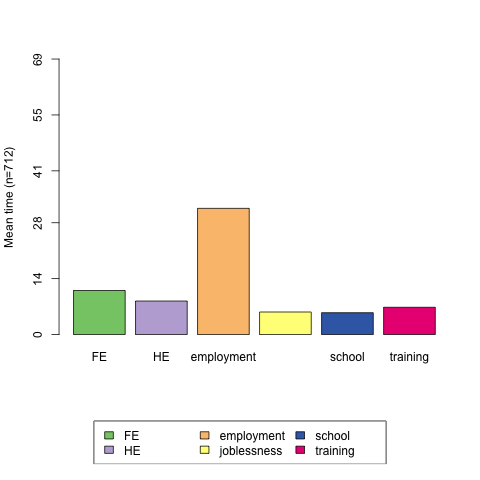

```{r setup, include=FALSE}
library(knitr)
knitr::opts_chunk$set(
	fig.retina = 3,
	message = FALSE,
	warning = FALSE,
	out.width = "60%",
	echo=TRUE
)
```

<style type="text/css">
.remark-slide-content {
    font-size: 26px;
    padding: 1em 4em 1em 4em;
}
</style>

# Your instructor

* Professor of Demography University of Bologna
* Co-Director ESRC Large centre  MiSoC based at Univesity of Essex
* Principal investigator ERC Consolidator GENPOP "Genes, Geneaology and the evolution of social Inequality"
* PhD Statistical Sciences University of Padua, Italy
* Associate member Nuffield College, Oxford University
* Research interests on:
  * Sequence Analysis for social sciences
  * Methods for demographic research
  * Sociogenomics
  * Use of geneaology data in historical demography
  

---
# Workshop

---
# Outline

---
# Life course paradigm

* The life course paradigm (Elder, 1985, 1994; Giele and Elder, 1998):
individuals, as human agents, build their future on the basis of the **constraints and opportunities** experienced in the past
* The process is **iterative and cumulative**, since initial advantages or disadvantages often are amplified with time
* Life courses are embedded in different time and location affected by the **social context** in which individuals live **life domains are strongly interdependent**.

---
# Transitions

* A transition is a discrete life change or event within a trajectory (e.g., from single to married).
* Transitions are often accompanied by socially shared ceremonies and rituals, such as a graduation or a wedding ceremony


---
# Trajectories
* A trajectory can also be envisioned as a sequence of transitions that are enacted over time
* A trajectory is a sequence of linked states within a conceptually defined range of behavior or experience.
* A trajectory is a long-term pathway, with age-graded patterns of development in major social institutions such as education or family


---
# Characteristics of life course data

* Longitudinal data
* Data collected by panel or retrospective survey
* occurrence of events, or timing when events happen
* Multiple domains (e.g. marital status, parenthood, education, work)
* Some events may not happen -> Observation are often censored
---
# Life course analysis

Life course analysis is the statistical analysis of data on:
1. the **timing** of events (when do events happen?),
2. their **quantum** (how many events happen?).
3. and their **sequencing** (in which order do events happen?)

---
# Event-based vs. Holistic approach
Two main approaches:

* The event-based approach focuses on events
    (mostly their timing and quantum)
* The holistic approach focuses on (parts) of the life course as a whole
    we focus contemporaneously on timing, quantum and sequences.
---
# Event-based approaches

* Event History Analysis (Survival analysis).
The unit of analysis is time to event. Data can be censored, i.e. we don’t observe the event for all the sample.
Continuous time Discrete time
* Panel Data analysis
---
# Holistic approaches

* **Sequence analysis**
* Latent Class Analysis
* Markov Models

---

# Sequence analysis

* In the 1990s Abbott introduced sequence analysis in the social sciences. Origins in information science and computational biology (DNA) (Abbott, 1995)
* Life courses are represented in terms of sequences of states (time is intrinsically discrete)
* As a simple example, we shall consider three states: single (**S**), cohabiting (**C**), married (**M**), in a monthly time scale from age 20 to 24. The sequence representation of an individual life course may thus be: **SSSSSSCCCCCCCSSSSSSSSSSSSSSSSSSSSSSCCCSSSSSSSSSSSMMMMMMMMM**


### Sequence analysis is a set of techniques for **describing and analyzing trajectories**

---

---

# Sequence representation

* Standard representation of a categorical time series **(STS) states-sequence (STS) format**
*A-A-A-B-B-C-C-C-C-D*

* More compact representations by giving only one of several same successive states (the **Distinct Successive State (DSS) sequence**) :
*A-A-A-B-B-C-C-C-C-D → A-B-C-D*

---
# Sequence representation (2)

* To keep time and alignment information successive distinct states are described with their duration (**State Permanence Sequence (SPS) representation**)
*A-B-C-D → (A,3)-(B,2)-(C,3)-(D,1)*

* Sequences can be described by their starting and ending
vertical **‘time-stamped-event’ (TSE) format**

| Start | End | State |
|-------|-----|-------|
| 1     | 3   | A     |
| 4     | 5   | B     |
| 9     | 6   | C     |
| 10    | 10  | D     |
     
---
# Optimal Matching Analysis (OMA)

Once we construct individual sequences, we need an instrument to measure dissimilarities.

OMA (Optimal Matching Analysis) is a method for the alignment of biosequences, which gives a **similarity measure for each pair of sequences**

OMA operates by transforming a sequence into another one by using three elementary operations:

* **insertion** of a state 
* **deletion** of a state 
* **substitution** of a state

Each operation has a “cost”. The distance between two sequences is the minimum total cost of transforming a life into another one.
---
class: middle
# Example

.center[
| S | A   | T   | U | R   | D | A | Y |                |
|---|-----|-----|---|-----|---|---|---|----------------|
| S | ~A~ | ~T~ | U | R   | D | A | Y | *deletion*     |
| S |     |     | U | *N* | D | A | Y | *substitution* |
]
---
# Distance between categorical time series

**How to compare life trajectories?**

> The **Levenshtein distance** between two strings is defined as the minimum number of edits needed to transform one string into the other, with the allowable edit operations being **insertion**, **deletion**, or **substitution** of a single character. It is named after Vladimir Levenshtein, who considered this distance in 1965.(Wikipedia)

https://phiresky.github.io/levenshtein-demo/

---
# Optimal Matching

* Andrew Abbott introduce the idea of sequence analysis in social science
* Great intuition! setting **different substitution costs**. Not all transitions are equal!
* First applications with costs based on theory


---

# Computing distances
A set that is composed of three basic operations $Ω = {ι,δ,σ}$,
1. $ι$ denotes **insertion** (one state is inserted into the sequence)
2. $δ$ denotes **deletion** (one state is deleted from the sequence)
3. $σ$ denotes **substitution** (one state is replaced by another
state).

****

* To each of these elementary operations $ω_k ∈ Ω,$ a specific
cost can be assigned, $c(ω_k)$.


* If $K$ basic operations must be performed to transform one sequence into another the transformation cost can be computed as $c(ω_1,\ldots, ω_K) = \sum^K_{k=1} c(ωk).$


### The **Matrix of dissimilarities** $(NxN)$ includes all the pairwise distances 

---
# what choice of costs?
* **substitution costs** can be derived from theory (e.g. occupational prestige, military ranking)
* using **inverse transition rates** (i.e. rare transitions have "higher costs")

---
# Computing distance of life courses

The resulting matrix of distance can be directly described (i.e. studying heterogeneity within groups) or used as input for further multivariate analyses, mostly cluster analysis (McVicar and Anyadike-Danes, 2002; Picarreta and Billari, 2007) or multidimensional scaling (Piccarreta and Lior, 2009).

Often we want to classify individuals in groups that share similar life course trajectories.

### Why?
* Theory
* Comparative analyses
* Creating groups for further analyses
---

# Key stages in a typical sequence analysis

1. describing key sequences by aggregate measures 
2. visualizing sequences via sequences index plots
3. comparing sequences via optimal-matching (OM) or alternative techniques (i.e obtaining a dissimilarity matrix)
4. grouping sequences into clusters via cluster methods
5. associating patterns with other variables within regression models
---

# What Questions?

Abbott, 1990 outlines three questions SA can answer
1. Identify typical sequential patterns
2. Identify why certain patterns exist (using covariates)
3. establish what the effects of a given sequential patter have on other outcomes

## Other possible questions include:
* Study of Heterogeneity in life course
* Matching individuals with similar trajectories
---
# Applications of SA

## Historical data
* Folk dancer movements (Abbott 1986)
* 18th century musician careers (Abbott 1990)
* Analysis of transition to adulthood Dutch cohorts born between 1850 and 1900 (Bras, Liefbroer and Elziga 2010)

---
# Applications of SA (2)

* **Professional careers** (Blair-Loy, 1990, Mc Vicar Anyadike-Danes, 2002)
* **Transition to retirement** (Han and Moen, 1999) 
* **Residential trajectories** (Stovel and Bolan, 2004)
* **Transportation** (time reference is a day)
* **Tourism behavior** (space as categories)
---


.small[Sequence Alignment as a Method for Human Activity Analysis in Space and Time (2007); Shoval and  Isaacson, *Annals of the Association of American Geographers*]

---


---
# Sequence Analysis and Demography

Sequence analysis have been applied to **demography**

* Transition to adulthood (Billari 2001; Aasve et al., 2007, Mouw, 2005 Sironi et al, 2021)
* Family and fertility (Billari and Piccarreta, 2005)
* Work and Family trajectories (Billari and Piccarreta, 2007)
* Family and health (Barban, 2013)

Previous attempt to study ordering of demographic and sociological events. (Hogan, 1987).
---
# Example: the mvad dataset

* Study from McVicar and Anyadike-Danes (2002) on transition from school to work in Northern Ireland
* 712 individuals
* Follow-up starting at the end of the compulsory education (July 1993)
* Time series of 70 status variables: September 1993 to June 1999.
* The **alphabet** is made of the following statuses: EM (employment), FE (Further Education), HE (Higher Education), JL (Joblessness), SC (School), TR (Training)

---
# Aim of the study

The aim of the original study was to:
* Use sequence techniques to characterize young peoples’ transitions from school to work into types
* Distinguish between successful and unsuccessful transitions
* Study the association of transition type with individual, family and school characteristics
* Identify which young people are more at risk to experience unsuccessful transitions into the labour market

---
# Distribution plot

 

---

# First ten common patterns

|                                       | Freq. | Perc. |
|---------------------------------------|-------|-------|
| training-employment                   | 53    | 7.4   |
| employment                            | 40    | 5.6   |
| employment-FE-employment              | 27    | 3.8   |
| school-HE                             | 27    | 3.8   |
| FE-employment                         | 25    | 3.5   |
| joblessness-FE-employment             | 18    | 2.5   |
| joblessness-training-employment       | 16    | 2.2   |
| school-FE-employment                  | 15    | 2.1   |
| joblessness-FE-joblessness-employment | 11    | 1.5   |
| school-employment                     | 11    | 1.5   |

---
# Average time spent in each state


 


---
# Sequence plot

 

---
# Modal state 

 


---
---
# Cluster Analysis

 

